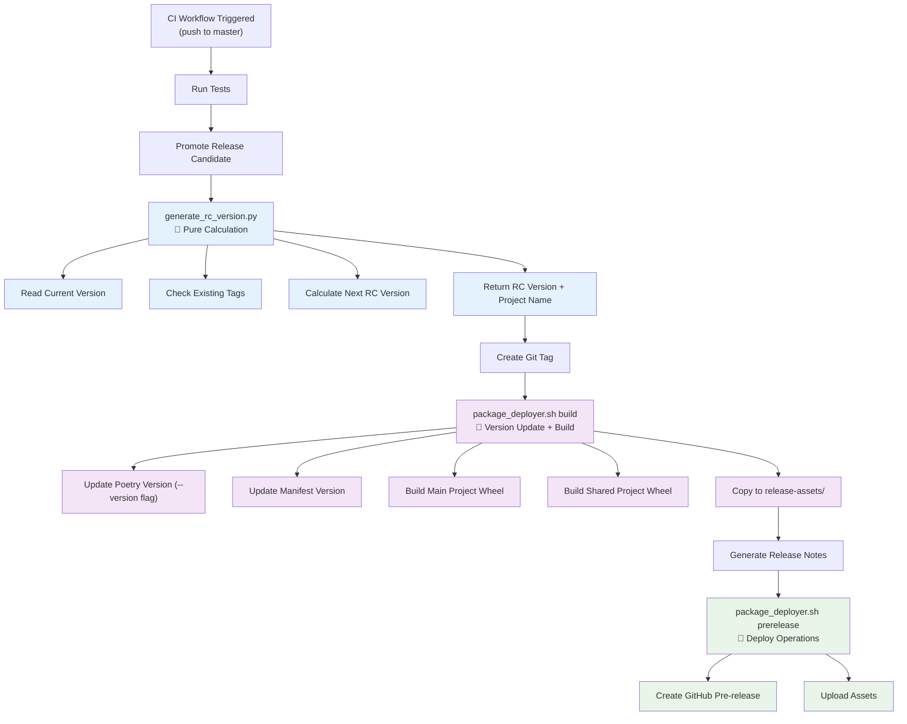

```mermaid
graph TD
    A["CI Workflow Triggered<br/>(push to master)"] --> B["Run Tests"]
    B --> C["Promote Release Candidate"]
    
    C --> D["generate_rc_version.py<br/>🧮 Pure Calculation"]
    D --> D1["Read Current Version"]
    D --> D2["Check Existing Tags"]
    D --> D3["Calculate Next RC Version"]
    D --> D4["Return RC Version + Project Name"]
    
    D4 --> E["Create Git Tag"]
    E --> F["package_deployer.sh build<br/>🔨 Version Update + Build"]
    F --> F1["Update Poetry Version (--version flag)"]
    F --> F2["Update Manifest Version"]
    F --> F3["Build Main Project Wheel"]
    F --> F4["Build Shared Project Wheel"]
    F --> F5["Copy to release-assets/"]
    
    F5 --> G["Generate Release Notes"]
    G --> H["package_deployer.sh prerelease<br/>🚀 Deploy Operations"]
    H --> H1["Create GitHub Pre-release"]
    H --> H2["Upload Assets"]
    
    style D fill:#e3f2fd
    style F fill:#f3e5f5
    style H fill:#e8f5e8
    style D1 fill:#e3f2fd
    style D2 fill:#e3f2fd
    style D3 fill:#e3f2fd
    style D4 fill:#e3f2fd
    style F1 fill:#f3e5f5
    style F2 fill:#f3e5f5
    style F3 fill:#f3e5f5
    style F4 fill:#f3e5f5
    style F5 fill:#f3e5f5
    style H1 fill:#e8f5e8
    style H2 fill:#e8f5e8
    
    classDef readOnly fill:#e3f2fd,stroke:#1976d2
    classDef buildOps fill:#f3e5f5,stroke:#7b1fa2
    classDef deployOps fill:#e8f5e8,stroke:#388e3c
```