```mermaid
graph TD
    A["CI Workflow Triggered<br/>(push to master)"] --> B["Run Tests"]
    B --> C["Promote Release Candidate"]
    
    C --> D["generate_rc_version.py<br/>🧮 Build-Once Version Calculation"]
    D --> D1["Read Current Version"]
    D --> D2["Check Existing Tags"]
    D --> D3["Calculate Final Package Version (1.0.0)"]
    D --> D4["Calculate RC Git Tag (v1.0.0-RC.1)"]
    D --> D5["Return: package_version + rc_tag"]
    
    D5 --> E["Create RC Git Tag (v1.0.0-RC.1)"]
    E --> F["package_deployer.py build<br/>🔨 Build with Final Version"]
    F --> F1["Update Poetry Version (1.0.0)"]
    F --> F2["Update Manifest Version (1.0.0)"]
    F --> F3["Build Main Project Wheel (1.0.0)"]
    F --> F4["Build Shared Project Wheel (1.0.0)"]
    F --> F5["Copy to release-assets/"]
    
    F5 --> G["Generate Release Notes<br/>📝 Immutable Artifacts Ready"]
    G --> H["package_deployer.py prerelease<br/>🚀 GitHub Pre-Release"]
    H --> H1["Create GitHub Pre-release (v1.0.0-RC.1)"]
    H --> H2["Upload Final Version Assets (1.0.0)"]
    
    H2 --> I["🎯 Manual GA Promotion"]
    I --> I1["Download SAME Artifacts (1.0.0)"]
    I --> I2["Create GitHub Release (v1.0.0)"]
    I --> I3["Upload SAME Artifacts to PyPI (1.0.0)"]
    I --> I4["Create PR: Next Dev Version (1.0.1)"]
    
    style D fill:#e3f2fd
    style F fill:#f3e5f5
    style H fill:#e8f5e8
    style I fill:#fff3e0
    style D1 fill:#e3f2fd
    style D2 fill:#e3f2fd
    style D3 fill:#e3f2fd
    style D4 fill:#e3f2fd
    style D5 fill:#e3f2fd
    style F1 fill:#f3e5f5
    style F2 fill:#f3e5f5
    style F3 fill:#f3e5f5
    style F4 fill:#f3e5f5
    style F5 fill:#f3e5f5
    style H1 fill:#e8f5e8
    style H2 fill:#e8f5e8
    style I1 fill:#fff3e0
    style I2 fill:#fff3e0
    style I3 fill:#fff3e0
    style I4 fill:#fff3e0
    
    classDef readOnly fill:#e3f2fd,stroke:#1976d2
    classDef buildOps fill:#f3e5f5,stroke:#7b1fa2
    classDef deployOps fill:#e8f5e8,stroke:#388e3c
    classDef promoteOps fill:#fff3e0,stroke:#f57c00
```

## **Build Once, Promote Many Approach**

This diagram shows the improved CI/CD flow following industry best practices:

### **🎯 Key Principles:**
- **Immutable Artifacts:** Packages built once with final version (1.0.0)
- **Channel-Based Promotion:** Git tags differentiate RC vs GA (v1.0.0-RC.1 vs v1.0.0)
- **No Rebuilding:** Same artifacts promoted from RC → GA → PyPI
- **Version Consistency:** No version contradictions between build and release

### **📋 Flow Stages:**
1. **Version Calculation** - Generate both package version (1.0.0) and RC tag (v1.0.0-RC.1)
2. **Build Once** - Create artifacts with final version, ready for production
3. **RC Pre-Release** - GitHub pre-release with immutable artifacts
4. **GA Promotion** - Promote same artifacts through channels without rebuilding