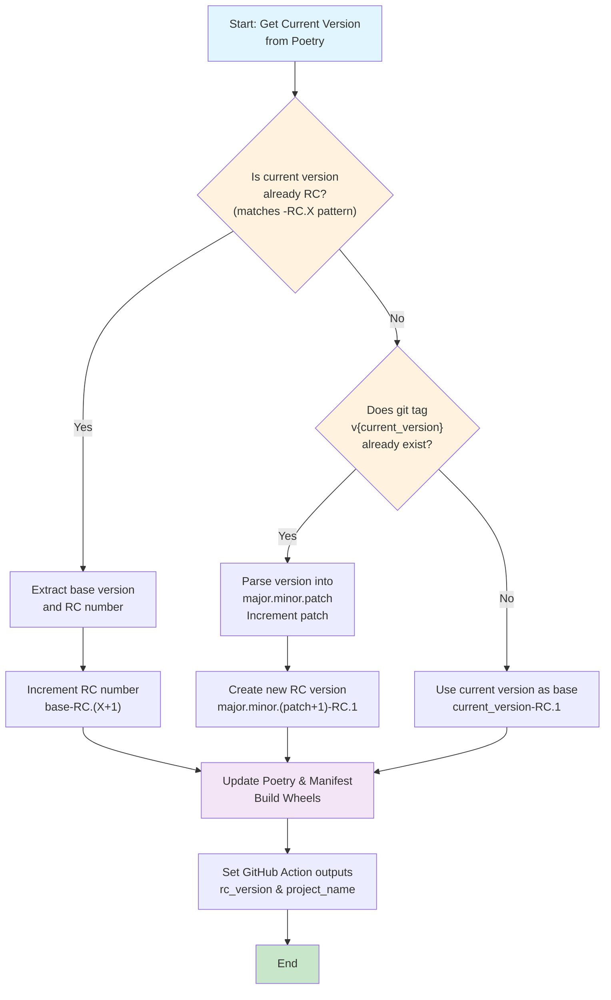

```mermaid
flowchart TD
    A["Start: Get Current Version<br/>from Poetry"] --> B{"Is current version<br/>already RC?<br/>(matches -RC.X pattern)"}
    
    B -->|Yes| C["Extract base version<br/>and RC number"]
    C --> D["Increment RC number<br/>base-RC.(X+1)"]
    D --> H["Update Poetry & Manifest<br/>Build Wheels"]
    
    B -->|No| E{"Does git tag<br/>v{current_version}<br/>already exist?"}
    
    E -->|Yes| F["Parse version into<br/>major.minor.patch<br/>Increment patch"]
    F --> G["Create new RC version<br/>major.minor.(patch+1)-RC.1"]
    G --> H
    
    E -->|No| I["Use current version as base<br/>current_version-RC.1"]
    I --> H
    
    H --> J["Set GitHub Action outputs<br/>rc_version & project_name"]
    J --> K["End"]
    
    style A fill:#e1f5fe
    style K fill:#c8e6c9
    style B fill:#fff3e0
    style E fill:#fff3e0
    style H fill:#f3e5f5
```